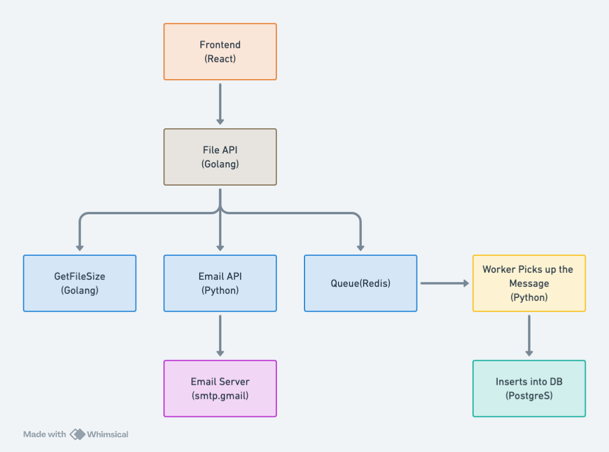

## Architecture Diagram



## Pre-requisites

- Docker
- docker-compose
- Get Authorization Token and OTLP Endpoint for your Last9 account.
- Update `otelcol-config.yaml` with the OTLP endpoint and Authorization header.
- Run following command
  ```
    docker-compose up
  ```
- Visit https://app.last9.io/explore to see the sample APM Dashboard powered by metrics and traces.
